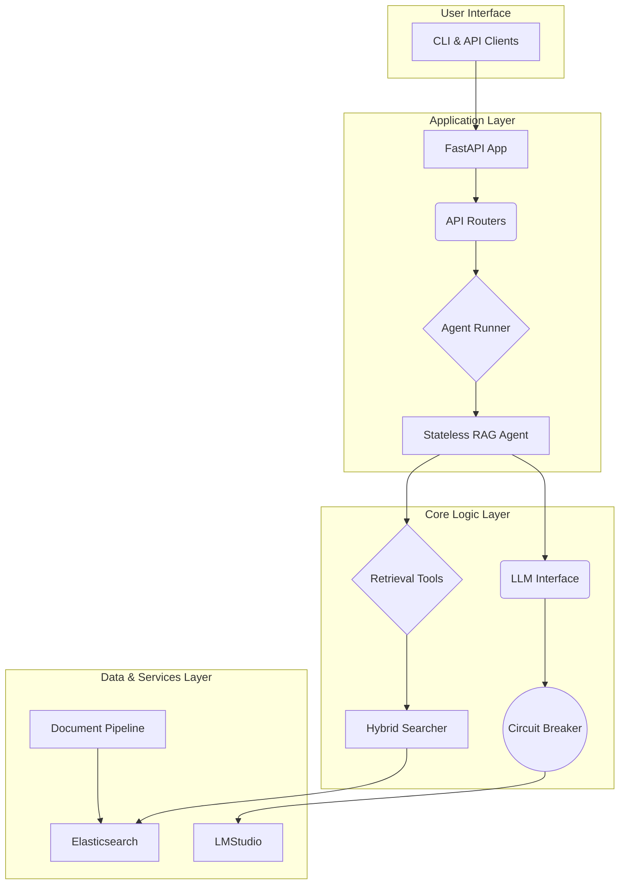

# Elastic RAG

**Elastic RAG** is a containerized Retrieval-Augmented Generation (RAG) system that combines the power of Elasticsearch for efficient document retrieval with a stateless agentic framework built on Google ADK. It's designed for developers who need a robust, scalable, and private RAG solution that can be deployed anywhere.

## 🚀 Features

- **Stateless Agent Architecture**: No conversation memory for easy scaling and predictable behavior
- **Local-First LLM Support**: Keep your data private with local LLM inference via LMStudio
- **Hybrid Search**: Combines vector similarity and BM25 keyword search for optimal retrieval
- **Multi-Format Document Processing**: Ingests PDF, DOCX, PPTX, HTML, and TXT files using Docling (only pdf files have been tested)
- **Resilient by Design**: Circuit breaker protects against LLM service failures
- **Health Monitoring**: Kubernetes-style health probes (`/health/live`, `/health/ready`, `/health/startup`)
- **Web UI**: Gradio-based development interface for testing and demos
- **Type-Safe Configuration**: Pydantic settings ensure valid configuration at startup
- **Secure by Default**: Automatic masking of secrets in logs
- **Containerized**: Ships as Docker container for easy deployment
- **Async Processing**: Supports asynchronous document uploads for large files
- **Production-Ready**: 319 tests with 85% core coverage, comprehensive error handling

## 🛠️ Core Technologies

- **Python 3.11+**: Modern, fast, and type-safe Python.
- **FastAPI**: High-performance web framework for the REST API.
- **Elasticsearch 8.x**: For robust document storage and hybrid search.
- **Google ADK**: For building the stateless RAG agent.
- **LiteLLM**: Provides a unified interface to various LLM providers.
- **Haystack 2.0**: Orchestrates the document processing and RAG pipeline.
- **Docling**: For reliable document-to-text conversion.
- **UV**: For fast and reliable dependency management.
- **Docker**: For containerization and reproducible deployments.
- **Taskfile**: For simple and consistent task automation.

## 🏗️ System Architecture

The system is designed with a clear separation of concerns, organized into distinct layers for maintainability and scalability.



- **Application Layer**: Handles incoming HTTP requests and orchestrates the agent.
- **Core Logic Layer**: Contains the stateless agent, retrieval tools, and LLM interface with resilience patterns.
- **Data & Services Layer**: Manages data persistence in Elasticsearch and communication with the local LLM.

For a deeper dive, see the full [Architecture Document](./docs/ARCHITECTURE.md).

## 🔌 API Overview

The system exposes a RESTful API for all interactions.

### Key Endpoints

- `POST /documents/upload` - Upload a single document
- `POST /documents/upload/async` - Upload with background processing
- `POST /documents/upload/batch` - Upload multiple documents
- `POST /query/` - Ask questions to the RAG agent (stateless)
- `GET /documents/` - List all indexed documents
- `DELETE /documents/{document_id}` - Delete a document and its chunks
- `GET /health/ready` - Check system readiness

**Interactive Documentation**: Visit `http://localhost:8000/docs` for full OpenAPI (Swagger) documentation.

For detailed API reference, see [API.md](./docs/API.md).

## ✨ Important Techniques Explained

### Stateless Agent Design

The core of our system is a **stateless RAG agent**. This means the agent has **no memory** of past conversations. Each query is treated as an independent event.

**Why is this important?**

- **Scalability**: You can run multiple instances of the agent behind a load balancer without worrying about session state.
- **Predictability**: The agent's response depends only on the current query and the retrieved context, making it easier to debug and test.
- **Simplicity**: The architecture is simpler, with no need for session management or conversation history storage.

### Circuit Breaker for Resilience

To prevent a failing LLM service from taking down the entire application, we use a **circuit breaker**.

**How it works:**

1. **Closed**: Requests to the LLM are made normally. If a request fails, a failure counter increments.
2. **Open**: If the failure counter exceeds a threshold (e.g., 5 failures), the circuit "opens." All subsequent requests to the LLM are blocked for a timeout period (e.g., 60 seconds), and a `503 Service Unavailable` error is returned immediately.
3. **Half-Open**: After the timeout, the circuit becomes "half-open." A limited number of test requests are allowed through. If they succeed, the circuit closes. If they fail, it opens again.

This pattern ensures that the system remains responsive and can gracefully degrade even when a critical dependency is down.

## 🏁 Getting Started

Follow these steps to get the Elastic RAG system up and running in minutes.

### Prerequisites

- **Docker**: Ensure Docker is installed and running
- **Python 3.11+**: Required for running local scripts
- **UV**: Install with `pip install uv`
- **Taskfile**: Installation instructions at [taskfile.dev](https://taskfile.dev/installation/)
- **LMStudio**: Download and run from [lmstudio.ai](https://lmstudio.ai/)
  - Download an embedding model (e.g., `openai/text-embedding-bge-m3` or `nomic-embed-text`)
  - Download a chat model (e.g., `openai/qwen3-30b-a3b-mlx` or `llama-3.2-3b-instruct`)
  - Start the local server in LMStudio (default: `http://localhost:1234`)

### Installation

1. **Clone the repository**:

    ```bash
    git clone <repository-url>
    cd elastic-rag
    ```

2. **Configure your environment**:

    ```bash
    task setup
    ```

3. **Install dependencies**:

    ```bash
    task install
    ```

4. **Start the services**:

    ```bash
    task start
    ```

### Verification

Verify all services are running:

```bash
task health
```

Access the interfaces:

- **API Documentation**: `http://localhost:8000/docs`
- **Gradio UI**: `task ui:dev` then visit `http://localhost:7860`
- **Elasticsearch**: `http://localhost:9200`

## 🚀 Usage Examples

This project includes a variety of examples to help you get started. You can find them in the `examples/` directory.

### Uploading a Document

To upload a document, use the `basic_upload.py` script:

```bash
uv run python examples/basic_upload.py /path/to/your/document.pdf
```

### Querying the System

To ask a question, use the `basic_query.py` script:

```bash
uv run python examples/basic_query.py "What is the main topic of the document?"
```

### cURL Examples

For more advanced usage, you can use the `curl_examples.sh` script to see how to interact with the API directly:

```bash
./examples/curl_examples.sh
```

## ⚙️ Common Commands

**Service Management**:

- `task start` - Start all services (Elasticsearch + App)
- `task stop` - Stop all services
- `task dev` - Start with hot-reloading
- `task ui:dev` - Start Gradio web UI (development mode)
- `task health` - Check system health

**Development**:

- `task test` - Run all tests with coverage (319 tests)
- `task lint` - Check code style
- `task format` - Auto-format code
- `task logs` - View service logs

**Full Command List**: Run `task --list` to see all available commands.

## 🎯 Web UI

A Gradio-based web interface is available for easy testing and demonstrations:

```bash
task ui:dev    # Start UI in development mode (localhost:7860)
task ui:start  # Start UI in production mode (0.0.0.0:7860)
```

**Features**:

- Document upload with drag & drop
- Document library with pagination
- Interactive chat with RAG agent
- Source citation display
- System health monitoring

See [UI_GUIDE.md](./docs/UI_GUIDE.md) for detailed usage instructions.

**Note**: The Gradio UI is a development/demo tool. Production deployments should use the FastAPI backend API directly.

## 🧪 Testing

**Test Coverage**: 319 tests with 85% core coverage

```bash
task test              # Run all tests with coverage
task test-unit         # Unit tests only
task test-integration  # Integration tests only
```

**Code Quality**:

```bash
task lint    # Check code style (ruff + black)
task format  # Auto-format code
```

## 📚 Documentation

**Core Documentation**:

- **[API.md](./docs/API.md)** - Complete REST API reference
- **[ARCHITECTURE.md](./docs/ARCHITECTURE.md)** - System architecture and data flows
- **[CONFIGURATION.md](./docs/CONFIGURATION.md)** - Configuration and environment variables
- **[UI_GUIDE.md](./docs/UI_GUIDE.md)** - Gradio web interface usage guide

**Development**:

- **[AGENTS.md](./AGENTS.md)** - Guide for AI coding agents

**Reports** (Recent):

- `Prompts/reports/2025-11-02_code_quality_review.md` - Production readiness assessment (Grade: A-)
- `Prompts/reports/2025-11-02_memory_leakage_analysis.md` - Memory management analysis (Grade: B+)

## 🤝 Contributing

Contributions are welcome! Please feel free to submit a pull request or open an issue.

## 📄 License

This project is licensed under the MIT License. See the [LICENSE](./LICENSE) file for details.
