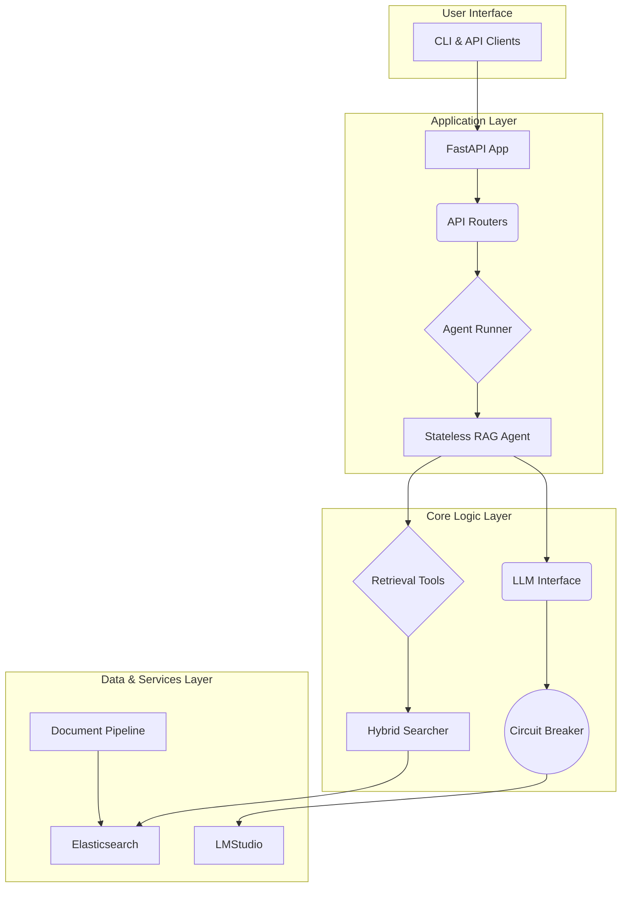

# Elastic RAG

**Elastic RAG** is a production-ready, containerized Retrieval-Augmented Generation (RAG) system that combines the power of Elasticsearch for efficient document retrieval with a stateless agentic framework built on Google ADK. It's designed for developers who need a robust, scalable, and private RAG solution that can be deployed anywhere.

## 🚀 Features

- [x] **Stateless Agent Architecture**: No conversation memory for easy scaling and predictable behavior.
- [x] **Local-First LLM Support**: Keep your data private with local LLM inference via LMStudio.
- [x] **Hybrid Search**: Combines vector similarity and BM25 keyword search for optimal retrieval.
- [x] **Multi-Format Document Processing**: Ingests PDF, DOCX, PPTX, HTML, and TXT files using Docling.
- [x] **Resilient by Design**: Features a circuit breaker to protect against LLM service failures.
- [x] **Health Monitoring**: Kubernetes-style health probes (`/health/live`, `/health/ready`, `/health/startup`).
- [x] **Type-Safe Configuration**: Pydantic settings ensure your configuration is valid at startup.
- [x] **Secure by Default**: Automatic masking of secrets in logs.
- [x] **Containerized**: Ships as a Docker container for easy deployment.
- [x] **Async Processing**: Supports asynchronous document uploads for large files.

## 🛠️ Core Technologies

- **Python 3.11+**: Modern, fast, and type-safe Python.
- **FastAPI**: High-performance web framework for the REST API.
- **Elasticsearch 8.x**: For robust document storage and hybrid search.
- **Google ADK**: For building the stateless RAG agent.
- **LiteLLM**: Provides a unified interface to various LLM providers.
- **Haystack 2.0**: Orchestrates the document processing and RAG pipeline.
- **Docling**: For reliable document-to-text conversion.
- **UV**: For fast and reliable dependency management.
- **Docker**: For containerization and reproducible deployments.
- **Taskfile**: For simple and consistent task automation.

## 🏗️ System Architecture

The system is designed with a clear separation of concerns, organized into distinct layers for maintainability and scalability.



- **Application Layer**: Handles incoming HTTP requests and orchestrates the agent.
- **Core Logic Layer**: Contains the stateless agent, retrieval tools, and LLM interface with resilience patterns.
- **Data & Services Layer**: Manages data persistence in Elasticsearch and communication with the local LLM.

For a deeper dive, see the full [Architecture Document](./docs/ARCHITECTURE.md).

## 🔌 API Overview

The system exposes a RESTful API for all interactions.

### Key Endpoints

- `POST /documents/upload`: Upload a single document for processing.
- `POST /documents/upload/batch`: Upload multiple documents at once.
- `POST /query/`: Ask a question to the RAG agent (stateless).
- `GET /documents/`: List all indexed documents.
- `GET /health/ready`: Check if the system is ready to accept traffic.

All endpoints are fully documented with OpenAPI (Swagger) at the `/docs` endpoint.

For detailed information on every endpoint, request/response models, and error codes, please refer to the [API Reference](./docs/API.md).

## ✨ Important Techniques Explained

### Stateless Agent Design

The core of our system is a **stateless RAG agent**. This means the agent has **no memory** of past conversations. Each query is treated as an independent event.

**Why is this important?**

- **Scalability**: You can run multiple instances of the agent behind a load balancer without worrying about session state.
- **Predictability**: The agent's response depends only on the current query and the retrieved context, making it easier to debug and test.
- **Simplicity**: The architecture is simpler, with no need for session management or conversation history storage.

### Circuit Breaker for Resilience

To prevent a failing LLM service from taking down the entire application, we use a **circuit breaker**.

**How it works:**

1. **Closed**: Requests to the LLM are made normally. If a request fails, a failure counter increments.
2. **Open**: If the failure counter exceeds a threshold (e.g., 5 failures), the circuit "opens." All subsequent requests to the LLM are blocked for a timeout period (e.g., 60 seconds), and a `503 Service Unavailable` error is returned immediately.
3. **Half-Open**: After the timeout, the circuit becomes "half-open." A limited number of test requests are allowed through. If they succeed, the circuit closes. If they fail, it opens again.

This pattern ensures that the system remains responsive and can gracefully degrade even when a critical dependency is down.

## 🏁 Getting Started

Follow these steps to get the Elastic RAG system up and running in minutes.

### Prerequisites

- [ ] **Docker**: Ensure Docker is installed and running.
- [ ] **Python 3.11+**: Required for running local scripts.
- [ ] **UV**: Install with `pip install uv`.
- [ ] **Taskfile**: Installation instructions at [taskfile.dev](https://taskfile.dev/installation/).
- [ ] **LMStudio**: Download and run from [lmstudio.ai](https://lmstudio.ai/).
  - [ ] Download an embedding model (e.g., `nomic-embed-text`).
  - [ ] Download a chat model (e.g., `Meta-Llama-3.1-8B-Instruct`).
  - [ ] Start the local server in LMStudio.

### Installation

1. **Clone the repository**:

    ```bash
    git clone <repository-url>
    cd elastic-rag
    ```

2. **Configure your environment**:

    ```bash
    task setup
    ```

3. **Install dependencies**:

    ```bash
    task install
    ```

4. **Start the services**:

    ```bash
    task start
    ```

### Verification

- **API**: Navigate to `http://localhost:8000/docs` to see the interactive API documentation.
- **Elasticsearch**: Check if Elasticsearch is running at `http://localhost:9200`.
- **Health**: Run the health check to verify all components are operational.

  ```bash
  task health
  ```

## 🚀 Usage Examples

This project includes a variety of examples to help you get started. You can find them in the `examples/` directory.

### Uploading a Document

To upload a document, use the `basic_upload.py` script:

```bash
uv run python examples/basic_upload.py /path/to/your/document.pdf
```

### Querying the System

To ask a question, use the `basic_query.py` script:

```bash
uv run python examples/basic_query.py "What is the main topic of the document?"
```

### cURL Examples

For more advanced usage, you can use the `curl_examples.sh` script to see how to interact with the API directly:

```bash
./examples/curl_examples.sh
```

## ⚙️ Taskfile Commands

This project uses `Taskfile` to automate common development tasks. Here are some of the most useful commands:

- `task setup`: Create `.env` file from `.env.example`.
- `task install`: Install/update dependencies with `uv`.
- `task start`: Start all services (Elasticsearch + App) in the background.
- `task stop`: Stop all running services.
- `task restart`: Restart all services.
- `task dev`: Start the application in development mode with hot-reloading.
- `task test`: Run the entire test suite with coverage report.
- `task test-unit`: Run only the unit tests.
- `task test-integration`: Run only the integration tests.
- `task test-e2e`: Run only the end-to-end tests.
- `task lint`: Run linting checks with `ruff` and `black`.
- `task format`: Auto-format code with `black` and `ruff`.
- `task type-check`: Run `mypy` type checking.
- `task logs`: Tail the logs of all running services.
- `task logs-app`: Tail the logs of the application service.
- `task logs-es`: Tail the logs of the Elasticsearch service.
- `task ps`: Show running services.
- `task shell`: Open a shell in the application container.
- `task clean`: Stop and remove all containers, volumes, and Python cache.
- `task health`: Check the health of all services.

To see a full list of available commands, run `task --list` or `task help` for a more detailed overview.

## 🔬 Demos

This project includes a series of demos that showcase the functionality of each component in isolation. You can find them in the `demos/` directory.

- `task demo-phase3`: Demonstrates the document processing pipeline.
- `task demo-phase4`: Demonstrates the Elasticsearch integration.
- `task demo-phase5`: Demonstrates the RAG agent and LLM integration.
- `task demo-phase6`: Demonstrates the resilience layer, including the circuit breaker and health probes.
- `task demo-phase7`: Demonstrates the full API functionality.
- `task demo-all`: Run all demos sequentially.
- `task demo-verify`: A script to verify that a document has been successfully uploaded and indexed.
- `task demo-health`: A script to check the health of all system components.
- `task verify`: A quick system health check (alias for `demo-health`).

To run a demo, use the corresponding `task` command.

## 🧪 Testing

The project has a comprehensive test suite with unit, integration, and end-to-end tests.

- **Run all tests**:

  ```bash
  task test
  ```

- **Run unit tests only**:

  ```bash
  task test-unit
  ```

- **Run integration tests**:

  ```bash
  task test-integration
  ```

For more details on the testing philosophy and how to write effective tests, see the [Testing Guide](./docs/TESTING_GUIDE.md).

## 📚 Documentation

This project is extensively documented to help you understand its architecture, configuration, and usage.

- **[GEMINI.md](./GEMINI.md)**: A high-level overview of the project, its features, and technologies.
- **[API Reference](./docs/API.md)**: Detailed documentation for all REST API endpoints.
- **[Architecture Deep Dive](./docs/ARCHITECTURE.md)**: An in-depth look at the system's architecture and data flows.
- **[Configuration Guide](./docs/CONFIGURATION.md)**: A complete reference for all environment variables and settings.

## 🤝 Contributing

Contributions are welcome! Please feel free to submit a pull request or open an issue.

## 📄 License

This project is licensed under the MIT License. See the [LICENSE](./LICENSE) file for details.
