# 4. Data Flow Diagrams

### 4.1 Document Ingestion Pipeline

**Purpose:** Transform documents into searchable chunks with embeddings

#### 4.1.1 High-Level Ingestion Flow

#### 4.1.2 Detailed Ingestion Sequence

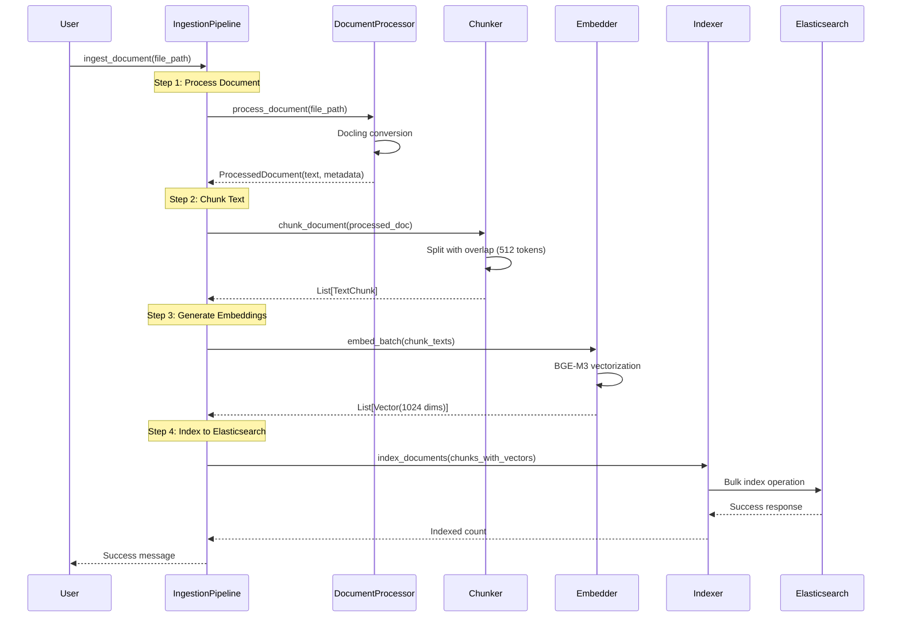

#### 4.1.3 Document Processor Details

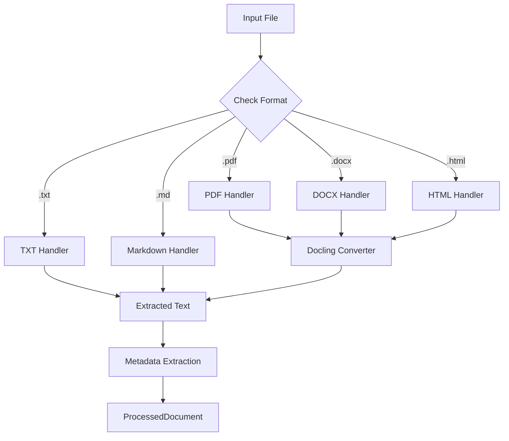

#### 4.1.4 Chunking Strategy

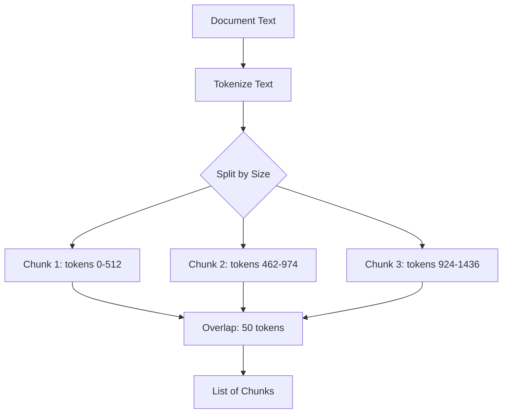

### 4.2 Query Processing Pipeline

**Purpose:** Retrieve relevant context and generate answers

#### 4.2.1 High-Level Query Flow

#### 4.2.2 Detailed Query Sequence

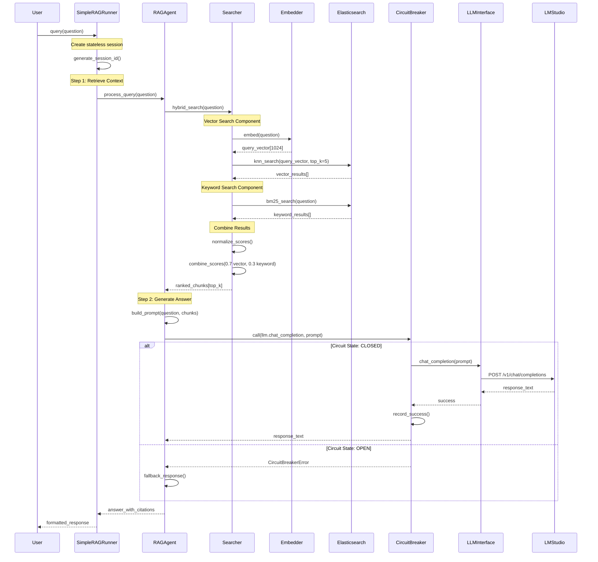

#### 4.2.3 Hybrid Search Algorithm

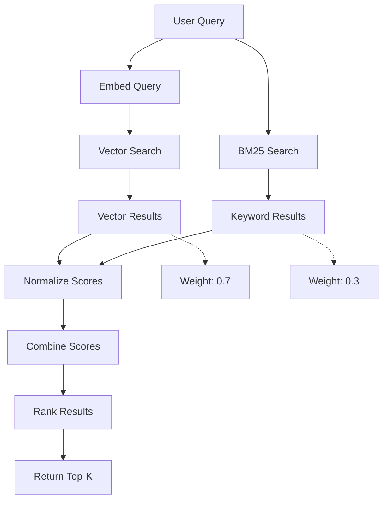

### 4.3 Circuit Breaker Pattern

**Purpose:** Prevent cascading failures in LLM communication

#### 4.3.1 Circuit Breaker State Machine

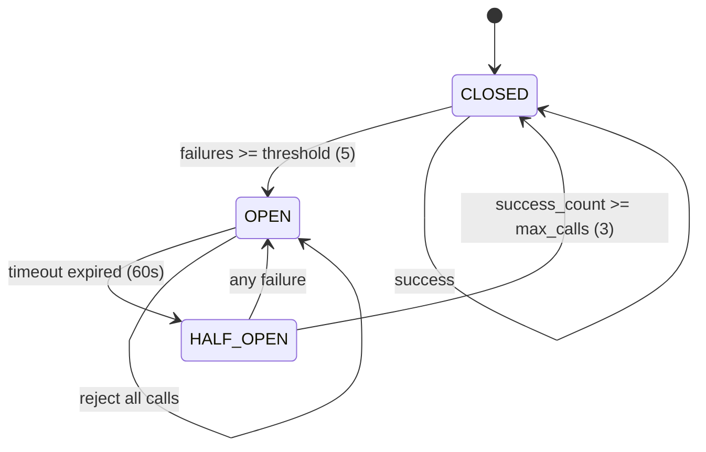

#### 4.3.2 Circuit Breaker Call Flow

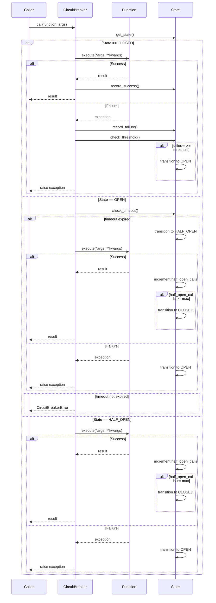

### 4.4 Health Monitoring System

**Purpose:** Kubernetes-style health probes for system monitoring

#### 4.4.1 Health Probe Types

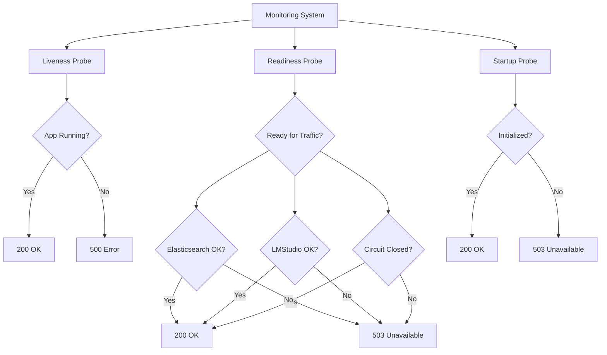

#### 4.4.2 Readiness Check Sequence

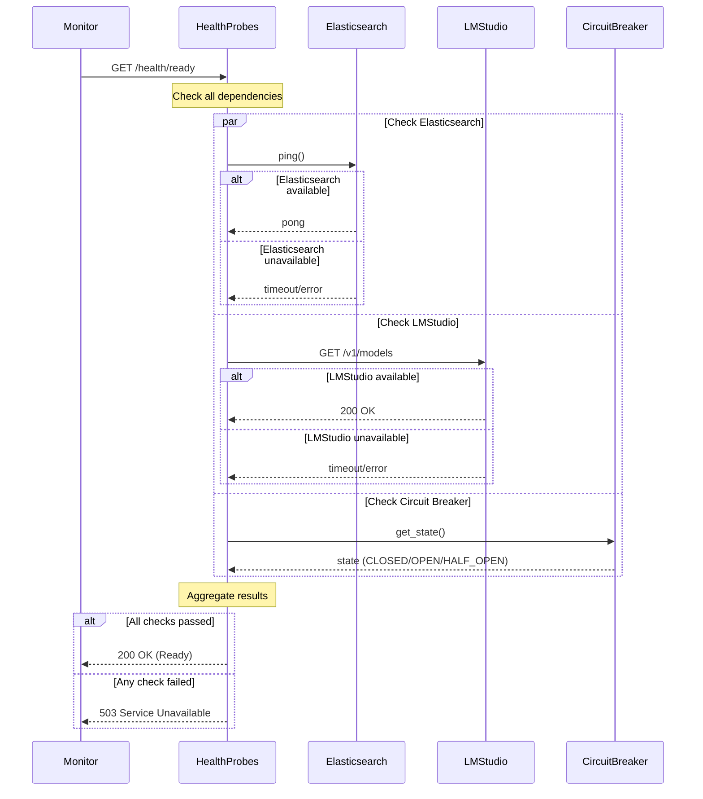

### 4.5 Configuration Loading

**Purpose:** Type-safe configuration with environment variables

#### 4.5.1 Configuration Hierarchy

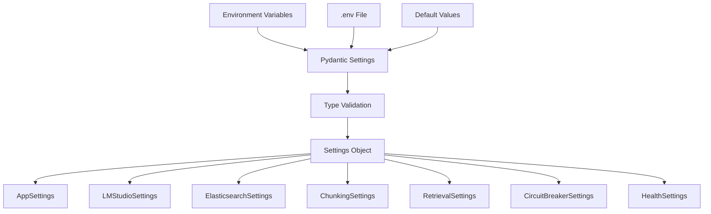

#### 4.5.2 Configuration Loading Sequence

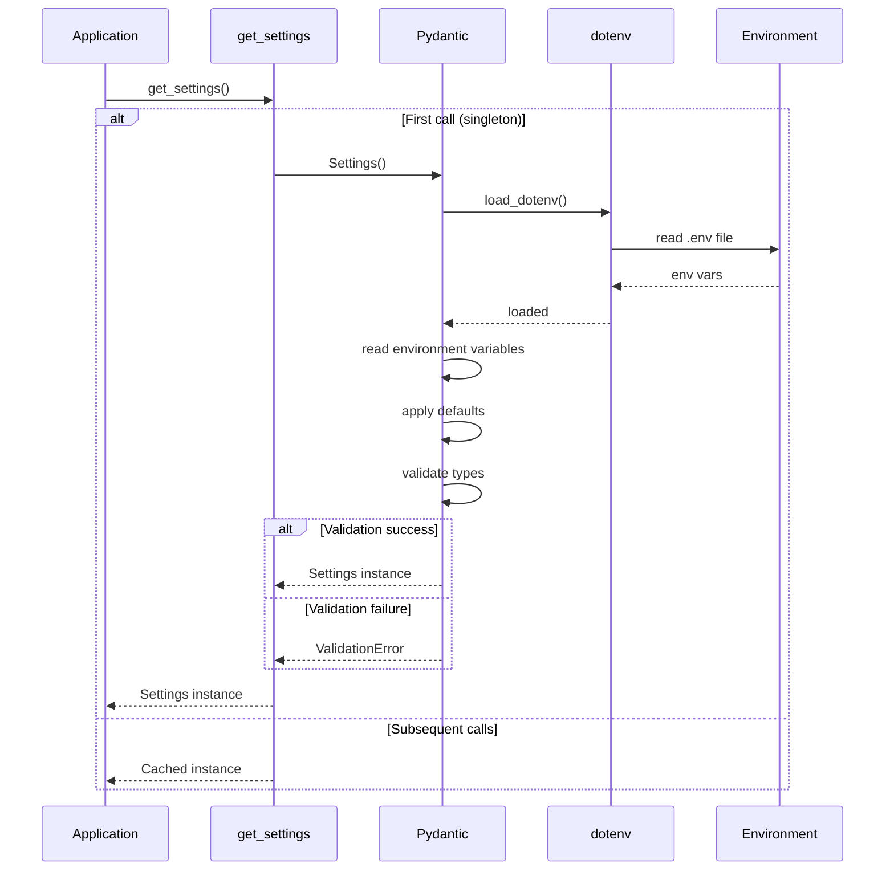
