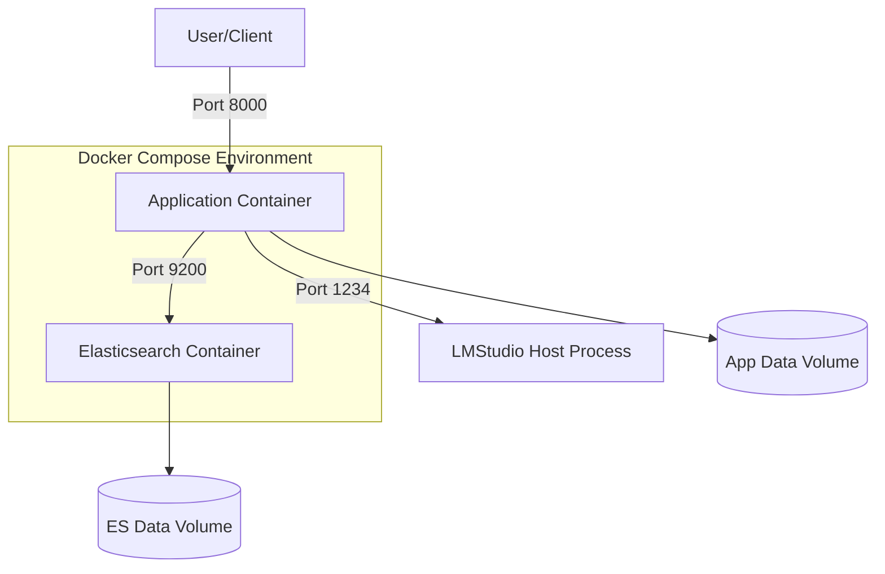
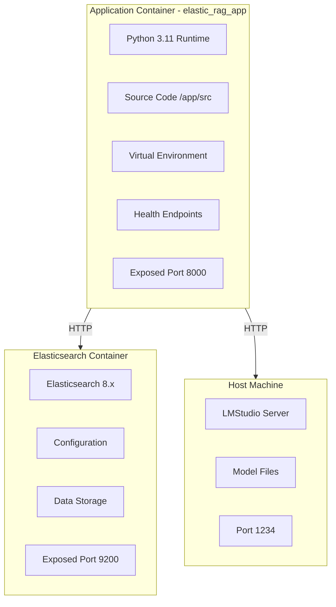
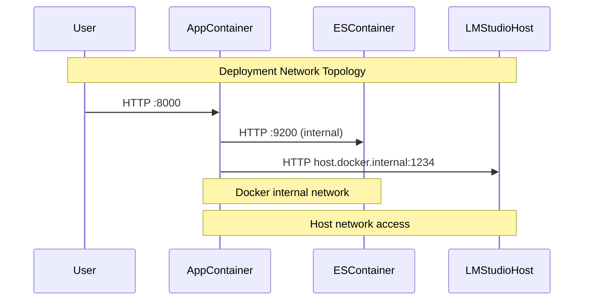

# 7. Deployment Architecture

### 7.1 Container Architecture Overview



### 7.2 Detailed Container Layout



### 7.3 Network Communication Flow



### 7.2 Docker Compose Configuration

```yaml
version: '3.8'

services:
  app:
    build: .
    ports:
      - "8000:8000"
    environment:
      - ELASTICSEARCH__HOST=elasticsearch
      - LMSTUDIO__BASE_URL=http://host.docker.internal:1234/v1
    depends_on:
      elasticsearch:
        condition: service_healthy
    healthcheck:
      test: ["CMD", "curl", "-f", "http://localhost:8000/health/live"]
      interval: 30s
      timeout: 10s
      retries: 3
      start_period: 40s
    volumes:
      - ./data:/app/data

  elasticsearch:
    image: docker.elastic.co/elasticsearch/elasticsearch:8.11.0
    environment:
      - discovery.type=single-node
      - xpack.security.enabled=false
    ports:
      - "9200:9200"
    volumes:
      - es_data:/usr/share/elasticsearch/data
    healthcheck:
      test: ["CMD-SHELL", "curl -f http://localhost:9200/_cluster/health || exit 1"]
      interval: 30s
      timeout: 10s
      retries: 5

volumes:
  es_data:
    driver: local
```

### 7.4 Docker Compose Configuration

The above YAML defines the complete Docker Compose setup for the application.

### 7.5 Resource Requirements

| Component | CPU | Memory | Storage |
|-----------|-----|--------|---------|
| **Application** | 1-2 cores | 2-4 GB | 1 GB |
| **Elasticsearch** | 2-4 cores | 4-8 GB | 10+ GB |
| **LMStudio** | 4-8 cores | 8-16 GB | 20+ GB |
| **Total** | 7-14 cores | 14-28 GB | 31+ GB |

### 7.6 Volume Mounts

| Volume | Purpose | Persistence |
|--------|---------|-------------|
| `es_data` | Elasticsearch indices | Docker volume |
| `./data` | Application data/cache | Host mount |
| LMStudio models | Model files | Host storage |
