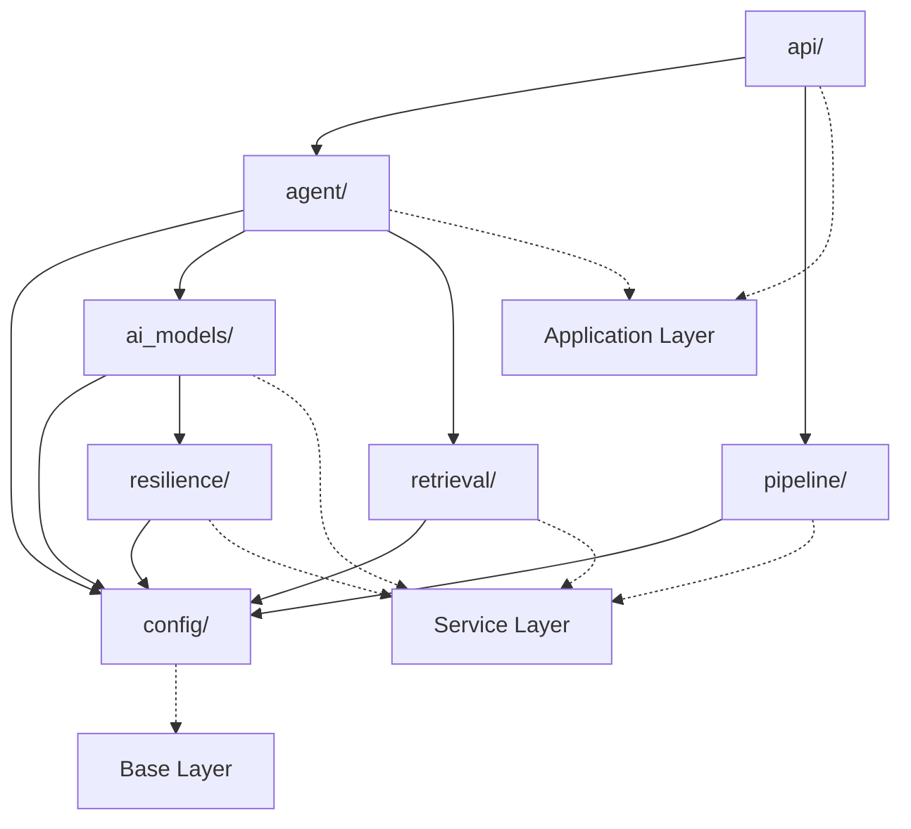
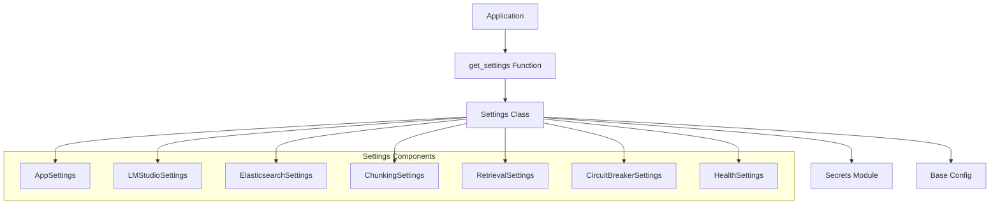
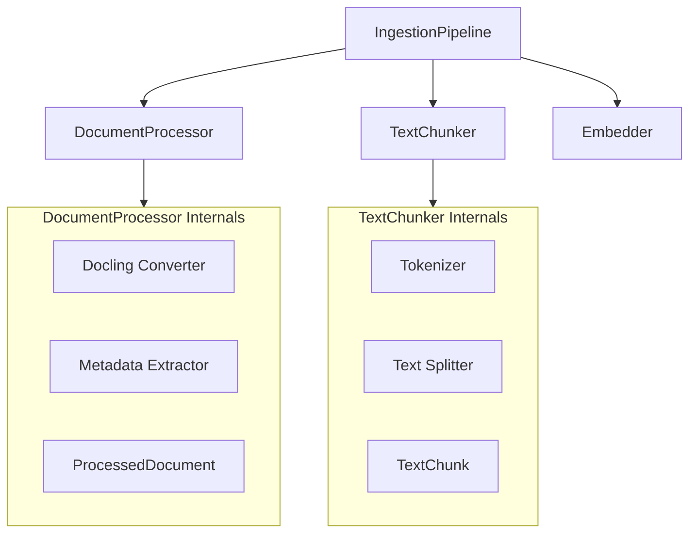
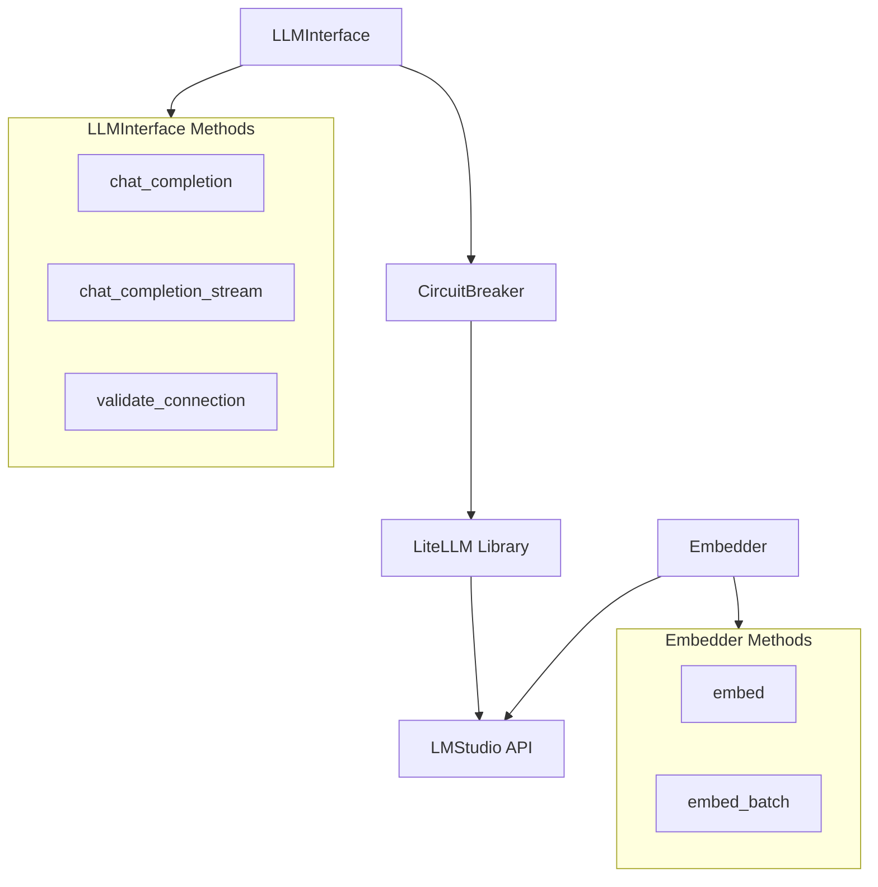
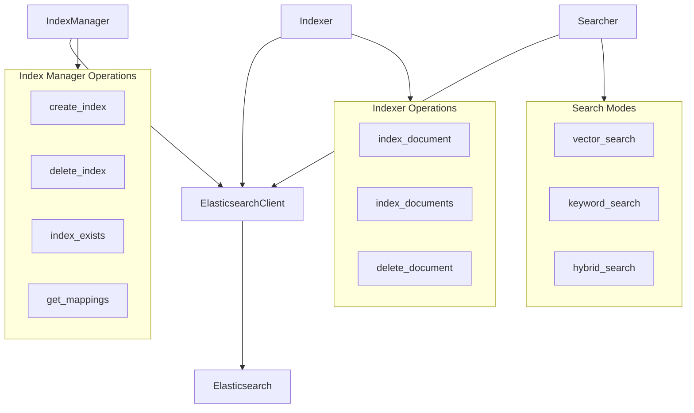
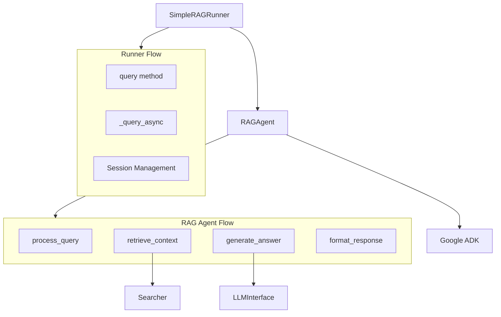
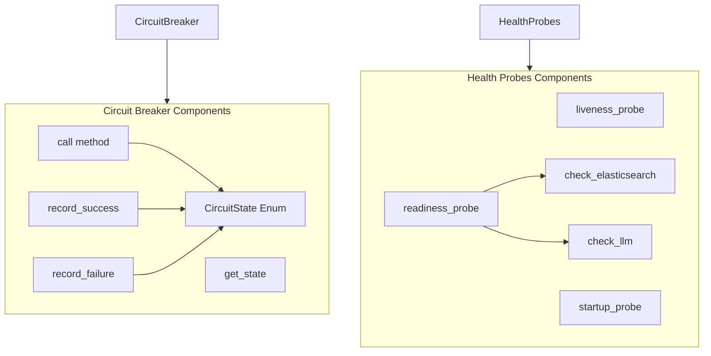

# 5. Module Structure

### 5.1 Source Code Organization

```
src/
├── __init__.py                      # Root package
├── main.py                          # Application entry point
│
├── config/                          # Configuration layer
│   ├── __init__.py
│   ├── base.py                     # Base config classes
│   ├── settings.py                 # Pydantic settings
│   └── secrets.py                  # Secrets management
│
├── pipeline/                        # Document processing
│   ├── __init__.py
│   ├── document_processor.py       # Docling integration
│   ├── chunker.py                  # Text chunking
│   └── ingestion.py                # Pipeline orchestration
│
├── ai_models/                       # LLM integration
│   ├── __init__.py
│   ├── litellm_interface.py        # Universal LLM adapter
│   └── embedder.py                 # Embedding generation
│
├── retrieval/                       # Search & storage
│   ├── __init__.py
│   ├── elasticsearch_client.py     # ES connection
│   ├── index_manager.py            # Index lifecycle
│   ├── indexer.py                  # Document indexing
│   └── searcher.py                 # Hybrid search
│
├── agent/                           # Agent layer
│   ├── __init__.py
│   ├── rag_agent.py                # Stateless agent
│   └── runner.py                   # Execution orchestration
│
├── resilience/                      # Reliability layer
│   ├── __init__.py
│   ├── circuit_breaker.py          # Circuit breaker
│   └── health_probes.py            # Health monitoring
│
└── api/                             # REST API
    └── __init__.py
```

### 5.2 Module Dependency Graph



### 5.3 Detailed Component Diagrams

#### 5.3.1 Configuration Layer Components



#### 5.3.2 Pipeline Layer Components



#### 5.3.3 AI Models Layer Components



#### 5.3.4 Retrieval Layer Components



#### 5.3.5 Agent Layer Components



#### 5.3.6 Resilience Layer Components


