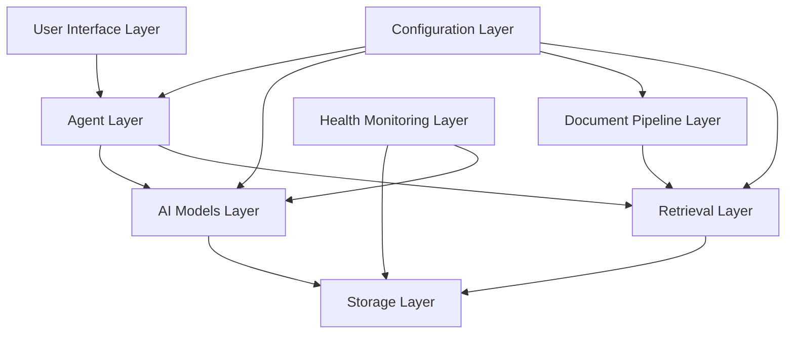
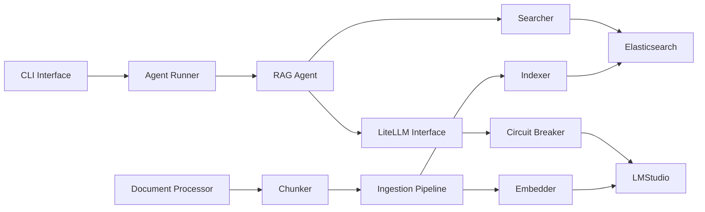

# System Overview

Elastic RAG is a production-ready Retrieval-Augmented Generation system that combines Elasticsearch for document storage and retrieval with Google ADK for stateless agent orchestration. The system uses local LLM inference via LMStudio for privacy-first AI capabilities.

## 1.1 System Layers Overview

The system is organized into distinct layers, each with specific responsibilities:

## 1.2 Component Interaction Map

---

# 2. Architecture Principles

## 2.1 Design Principles

1. **Stateless Agent Design**
   - No conversation memory or session state
   - Each query is independent
   - Enables horizontal scaling
   - Simplifies testing and debugging

2. **Local-First LLM**
   - Privacy-first approach with local inference
   - No data sent to cloud providers
   - Full control over models and data
   - LiteLLM provides abstraction for future cloud providers

3. **Separation of Concerns**
   - Clear module boundaries
   - Single responsibility per component
   - Configuration isolated from business logic
   - Secrets separated from regular config

4. **Resilience by Design**
   - Circuit breakers prevent cascading failures
   - Health probes enable monitoring
   - Graceful degradation on service failures
   - Automatic recovery mechanisms

5. **Configuration as Code**
   - Type-safe configuration with Pydantic
   - Environment-based settings
   - Validation on startup
   - Clear error messages for misconfigurations
