# 3. System Architecture

### 3.1 High-Level Components

```mermaid
graph TB
    subgraph Docker["🐳 Docker Container"]
        subgraph HealthLayer["🏥 Health & Monitoring"]
            HEALTH[🩺 Health Probes<br/>Liveness/Readiness/Startup]
        end

        subgraph Ingestion["Document Ingestion Pipeline"]
            DOC[📄 Docling<br/>Document Converter]
            HAY[🔄 Haystack<br/>RAG Pipeline]
            CHUNK[✂️ Text Chunker]
            ES[(🔍 Elasticsearch<br/>Index & Store)]

            DOC -->|Convert to Text| HAY
            HAY -->|Split| CHUNK
            CHUNK -->|Index with Vectors| ES
        end

        subgraph Agent["🤖 Google ADK Agent - Stateless"]
            QUERY[❓ User Query]
            RETRIEVE[📚 Context Retrieval]
            CB[🛡️ Circuit Breaker<br/>Failure Protection]
            LITE[🔌 LiteLLM<br/>Interface]
            LMS[💻 LMStudio<br/>Local Inference]
            GEN[✨ Answer<br/>Generation]

            QUERY -->|Search| ES
            ES -->|Return Chunks| RETRIEVE
            RETRIEVE -->|Context + Query| CB
            CB -->|Protected Call| LITE
            LITE -->|API Call| LMS
            LMS -->|Embeddings & Chat| LITE
            LITE -->|Response| CB
            CB -->|Safe Response| GEN
        end

        subgraph Resilience["🔧 Resilience Layer"]
            CB_MONITOR[📊 Monitor LLM Health]
            FALLBACK[⚠️ Fallback Strategy]
        end

        subgraph External["External Services"]
            LMSTUDIO[🖥️ LMStudio Server<br/>localhost:1234]
        end

        LMS -.->|HTTP API| LMSTUDIO
        CB <-->|Health Check| CB_MONITOR
        CB_MONITOR -->|Circuit Open| FALLBACK
        FALLBACK -->|Graceful Degradation| GEN

        HEALTH -.->|Check| ES
        HEALTH -.->|Check| LMSTUDIO
        HEALTH -.->|Check| CB_MONITOR
    end

    USER([👤 User]) -->|Upload Documents| DOC
    USER -->|Ask Questions| QUERY
    GEN -->|Answers with Citations| USER
    MONITOR([🔍 Monitoring System]) -.->|Health Probes| HEALTH

    classDef stateless stroke:#f90,stroke-width:3px,stroke-dasharray: 5 5
    class Agent stateless
```

### 3.2 Component Responsibilities

#### 3.2.1 Elasticsearch

- **Primary Role:** Document indexing, storage, and retrieval
- **Responsibilities:**
  - Store document chunks with vector embeddings
  - Perform semantic and keyword search
  - Manage document metadata
  - Handle search queries from the RAG pipeline

#### 3.2.2 Agent (Google ADK)

- **Primary Role:** Stateless answer generation
- **Responsibilities:**
  - Process individual user queries (stateless)
  - Receive query and retrieved context
  - Generate contextual responses based solely on provided context
  - Cite sources in responses
  - Interface with LLM providers via LiteLLM
- **Important Constraints:**
  - **NO memory or conversation history** - each query is independent
  - Agent does not maintain state between requests
  - All context must be provided in each request

#### 3.2.3 Reliability Components

- **Circuit Breaker:**
  - Protects against cascading failures when communicating with LLM services
  - Monitors LLM API health and automatically opens circuit on repeated failures
  - Implements fallback strategies and graceful degradation

- **Health Probes:**
  - **Liveness Probe:** Indicates if application is running and should be restarted
  - **Readiness Probe:** Indicates if application is ready to accept traffic
  - **Startup Probe:** Indicates if application has completed initialization#### 3.2.4 Supporting Components

- **Docling:** Document format conversion (PDF, DOCX, etc.)
- **Haystack:** RAG pipeline orchestration and text chunking
- **LiteLLM:** Unified interface for multiple LLM providers
- **LMStudio:** Local LLM inference engine
